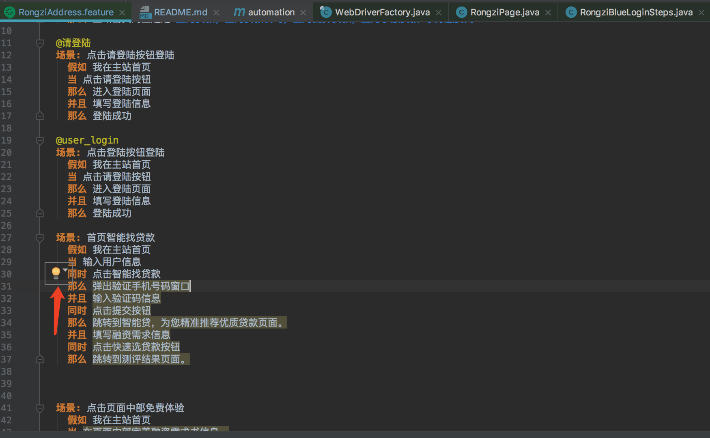
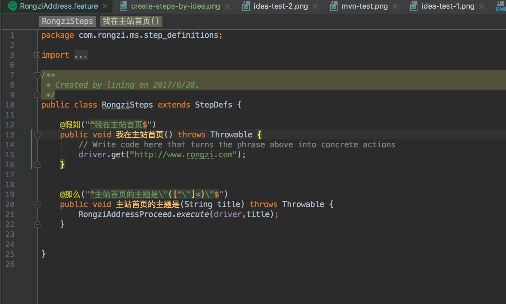

# Automation

## Cucumber doc
[cucumber-jvm](https://cucumber.io/)  
[selenium](http://www.seleniumframework.com/)  

## Cucumber examples
[CucumberJVMExamples](https://github.com/machzqcq/CucumberJVMExamples)  
[cucumber-jvm](https://github.com/cucumber/cucumber-jvm/tree/master/examples)  

## Quickstart  
1. pom.xml添加依赖  
2. 创建 feature 文件  
|   en   |   zn   | 
| ---- | ---- | 
| feature | "功能" |
| background | "背景" |
| scenario | "场景", "剧本" |
| scenario outline | "场景大纲", "剧本大纲" |
| examples | "例子" |
| given (code) | "假如", "假设", "假定" |
| when (code) | "当" |
| then (code) | "那么" |
| and (code) | "而且", "并且", "同时" |
| but (code) | "但是" |

3. 写步骤  
&emsp;(1) 点击该提示图标，并从弹出的菜单项中选择“Create Step Definition”或者“Create All Steps Definition”；  
&emsp;&emsp;  
&emsp;(2)  在弹出的“Create New Step Definition File”模式窗口中填写文件名称、实现语言以及文件位置等信息即可；  
&emsp;&emsp;   

