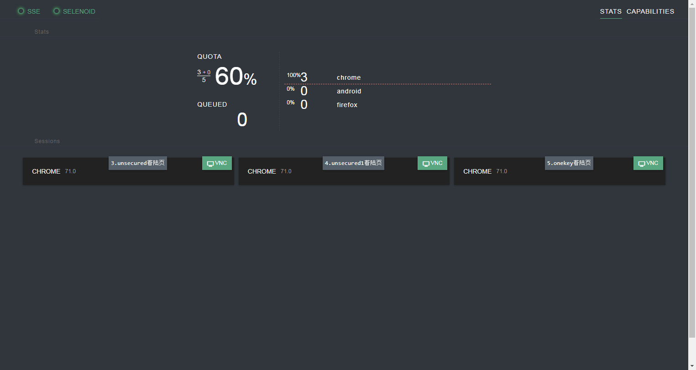
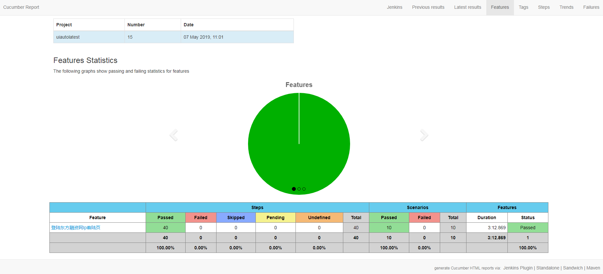

# Automation(Cucumber + Selenium)  

## 1参考文档  
- [cucumber-jvm](https://cucumber.io/)  
- [selenium](http://www.seleniumframework.com/)  
- [zalenium](https://opensource.zalando.com/zalenium/)
- [selenoid](https://aerokube.com/selenoid/latest/)
- [多线程](http://grasshopper.tech/466/)
- [并行报告](https://github.com/prashant-ramcharan/courgette-jvm)

## 2Cucumber例子  
- [CucumberJVMExamples](https://github.com/machzqcq/CucumberJVMExamples)  
- [cucumber-jvm](https://github.com/cucumber/cucumber-jvm/tree/master/examples)  

## 3环境搭建  
### 3.1安装docker
  - 安装docker-ce `yum -y install docker-ce`  
  - 检查版本 `docker -v`  
  - 启动docker `systemctl start docker` (开机启动systemctl enable docker)  
  - 可选择性安装docker-compose   
    

    | docker常用命令               |                  |
    | ---------------- | ------------------ |
    | 重启docker          | service docker restart                  |
    | 删除image | docker rmi     |
    | 删除container | docker rm |
    | 重启container | docker restart |
    | container的目录 | /var/lib/docker/containers |
    | 查看container的大小 | du -sh * |
    | 进入container内部 | docker exec -ti -u root xxxxxxx  bash |
    | 查看container的列表 | docker ps -a   |
    | 启动多个container  | docker start xxxxxx  yyyyyyy |
    

### 3.2安装执行平台selenoid（也可选zalenium）  
#### 3.2.1下载镜像  
  - docker pull aerokube/selenoid-ui     #实时观看
  - docker pull aerokube/selenoid        #主体
  - docker pull selenoid/video-recorder  #录制视频
  - docker pull selenoid/vnc_chrome      #各种版本
  - docker pull selenoid/vnc_firefox     #各种版本

#### 3.2.2配置浏览器  
  - 在/home/目录下创建config/browsers.json浏览器配置文件
    

#### 3.2.3启动selenoid   
  - 在/home/目录下执行命令   

        docker run -d      \
        --name selenoid                                 \
        -p 14444:4444                                    \
        -v /var/run/docker.sock:/var/run/docker.sock    \
        -v `pwd`/config/:/etc/selenoid/:ro              \
        -v `pwd`/video/:/opt/selenoid/video/            \
        -e OVERRIDE_VIDEO_OUTPUT_DIR=`pwd`/video/       \
        aerokube/selenoid:latest-release      
  
#### 3.2.4启动selenoid-ui   
  - 在/home/目录下执行命令  

        docker run -d --name selenoid-ui --link selenoid  -p 8084:8080 aerokube/selenoid-ui --selenoid-uri=http://selenoid:4444    

#### 3.2.5检查状态  
  - 检查selenoid状态  `http://10.40.4.200:14444/status`  
  - 检查selenoid-ui状态  `http://10.40.4.200:8084`
  - 如果看不到selenoid-ui可能需要关闭centos防火墙  

        sudo systemctl stop firewalld  
        sudo systemctl disable firewalld   

### 3.3安装jenkins（一般不在jenkins节点编译）   
  - 因为要执行mvn，所以自己编译一个jenkins镜像
  - 创建一个Dockerfile文件，这里顺带把docker也编进去了  
  - 在文件当前目录下执行 `docker build  -t  jenkinssjj`   

        FROM jenkins/jenkins:lts
        
        USER root
        ARG dockerGid=994
        
        RUN echo "docker:x:${dockerGid}:jenkins" >> /etc/group
        
        ENV MAVEN_VERSION 3.6.0
        RUN curl -fsSL https://archive.apache.org/dist/maven/maven-3/$MAVEN_VERSION/binaries/apache-maven-$MAVEN_VERSION-bin.tar.gz | tar xzf - -C /usr/share \
        && mv /usr/share/apache-maven-$MAVEN_VERSION /usr/share/maven \
        && ln -s /usr/share/maven/bin/mvn /usr/bin/mvn
        
        ENV MAVEN_HOME /usr/share/maven
        VOLUME /root/.m2
        
        USER jenkins   

  - 启动jenkins   

        docker run -d  --name jenkinsX  -p  38080:8080 -p  30000:50000  -v  ~/volumes/jenkins_home:/var/jenkins_home   -v   /var/run/docker.sock:/var/run/docker.sock   -v  /usr/bin/docker:/usr/bin/docker   -v   /usr/lib64/libltdl.so.7:/usr/lib/x86_64-linux-gnu/libltdl.so.7   jenkinssjj   
 
### 3.4检查网络（使jenkins、selenoid、selenoidui在一个网段内）  
  - 进入jenkins容器内部（安装网络工具）
  - apt-get update
  - apt install net-tools       # ifconfig 
  - apt install iputils-ping     # ping
  

  
## 4使用说明    
1. 在pom.xml文件中添加依赖    
2. 在resources/features文件夹中创建feature文件  

    | en               | zn                 |
    | ---------------- | ------------------ |
    | feature          | 功能               |
    | background       | 背景               |
    | scenario         | 场景, 剧本         |
    | scenario outline | 场景大纲, 剧本大纲 |
    | examples         | 例子               |
    | given            | 假如, 假设, 假定   |
    | when             | 当                 |
    | then             | 那么               |
    | and              | 而且, 并且, 同时   |
    | but              | 但是               |

3. 继承BaseSteps类，编写Step Definition  
4. 编写Page页面类   
5. 在/home/config下browsers.json文件中可以安装浏览器（配置后需要重启下selenoid容器）   

        {
                "chrome": {
                "default": "71.0",
                "versions": {
                    "71.0": {
                        "image": "selenoid/vnc_chrome:71.0",
                        "port": "4444",
                        "path": "/"
                    }
                }
            },
            "firefox": {
                "default": "66.0",
                "versions": {
                    "64.0": {
                        "image": "selenoid/vnc_firefox:64.0",
                        "port": "4444",
                        "path": "/wd/hub"
                    },
                                "66.0": {
                                        "image": "selenoid/vnc:firefox_66.0",
                        "port": "4444",
                        "path": "/wd/hub"
                    }
                }
            },
                "android": {
                "default": "6.0",
                "versions": {
                    "6.0": {
                        "image": "selenoid/android:6.0",
                        "port": "4444",
                        "path": "/wd/hub"
                    }
                }
            }
        }
  
6. 在runner目录下BaseSteps类中可以配置浏览器大小，屏幕大小，浏览器类型，是否实时查看，是否录制视频，浏览器代理  
7. 检查selenoid有哪些浏览器可用 `http://10.40.4.200:14444/status`  
8. pom文件中的这两个数字控制并发的线程数    

        <properties>
            <property>
                <name>dataproviderthreadcount</name>
                <value>3</value>
            </property>
        </properties>
     
        <parallel>classes</parallel>
        <threadCount>3</threadCount>
        <perCoreThreadCount>true</perCoreThreadCount>

    
9. 本地调试举例   
    `mvn clean verify   -Dcucumber.options="--tags @pc_web_rongzi"  -Denv=PC`  
    `mvn clean verify   -Dcucumber.options="--tags @mobile_web_lp"  -Denv=Mobile`  
  
10. 实时查看地址（selenoid-ui）：http://10.40.4.200:8084   
       

11. 测试完成后，查看录制的视频：http://10.40.4.200:14444/video/  
    录制视频的目录：/home/video  
    现在的策略是覆盖，保留最新的视频  
    
12. 编写jenkinsfile文件   

13. jenkins使用
    - 地址  http://10.40.4.200:38080  admin   123456    
    - 安装*Cucumber reports*插件    
    - 创建*Pipeline*任务    
    - 查看报告   
       
    

## 5其他
### 5.1appium安装  
- 安装[node.js](http://nodejs.cn/)  
- 安装appium `npm install -g appium` PS：安装不成功，使用[GUI版本](https://github.com/appium/appium-desktop/releases)    
- 安装appium doctor `npm install -g appium-doctor`  
- 检查环境 `appium-doctor`  
- 启动appium

### 5.2安装zalenium  
- 下载selenium镜像（非官方）`docker pull elgalu/selenium`  
- 下载zalenium镜像（非官方）`docker pull dosel/zalenium`    

### 5.1Chrome对应webdriver版本   
- http://npm.taobao.org/mirrors/chromedriver/  

### 5.4selenium获取页面所有元素 
- findElementsByXPath("//*") 

