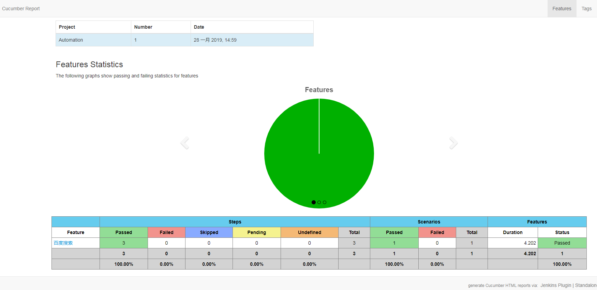

# Automation

## Cucumber doc
[cucumber-jvm](https://cucumber.io/)  
[selenium](http://www.seleniumframework.com/)  


## Cucumber examples
[CucumberJVMExamples](https://github.com/machzqcq/CucumberJVMExamples)  
[cucumber-jvm](https://github.com/cucumber/cucumber-jvm/tree/master/examples)  


## Quickstart  
1. pom.xml添加依赖  
2. 创建 feature 文件  

    | en               | zn                 |
    | ---------------- | ------------------ |
    | feature          | 功能               |
    | background       | 背景               |
    | scenario         | 场景, 剧本         |
    | scenario outline | 场景大纲, 剧本大纲 |
    | examples         | 例子               |
    | given            | 假如, 假设, 假定   |
    | when             | 当                 |
    | then             | 那么               |
    | and              | 而且, 并且, 同时   |
    | but              | 但是               |


3. 编写Step Definition  
4. 创建JUnit Test运行类    [RunCukesTest](src/test/java/RunCukesTest.java)  
5. 运行  
    `mvn verify`, 在 *target/reports* 目录下就可以浏览生成的报告  
       
    

## 进阶使用  
    ### 一、运行命令  
        下载driver ` mvn com.lazerycode.selenium:driver-binary-downloader-maven-plugin:selenium`  
        ```
        mvn clean verify
        -Dcucumber.options="--tags @baidu"                  设置执行的tag
        -Dwebdriver=chrome                                  设置driver为chrome
        -Pprod                                              设置代理
        -Drongzi.city=shanghai                              设置自定义参数
        -Dremote.hub=http://192.168.199.106:4444/wd/hub     设置Selenium Grid地址
        -Pparallel,dev -Dproxy.enable=true                  设置多线程
        ```

    ### 二、运行命令
        安装Appium